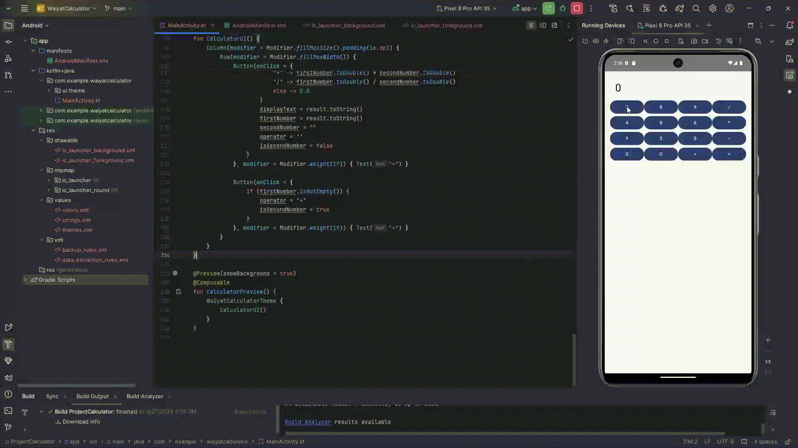

# AndroidCal
Learning Android Studio With Kotlin by building a simple Calculator App

## Table of Contents
- [Android App](#android-app)
- [Run Android Studio](#run-android-studio)

## Android App

## Run Android Studio
- please install the following sdk (api 29 - the earliest at least until api 35)
- please install device manager pixel 8 pro API 35
- then run MainActivity.kt

